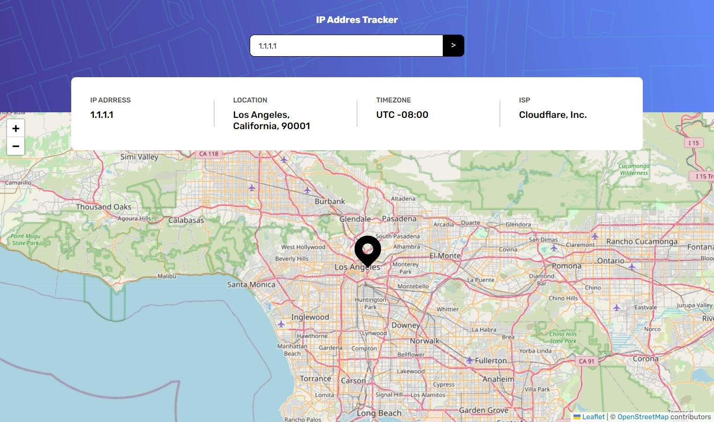

# Frontend Mentor - IP address tracker solution

This is a solution to the [IP address tracker challenge on Frontend Mentor](https://www.frontendmentor.io/challenges/ip-address-tracker-I8-0yYAH0). Frontend Mentor challenges help you improve your coding skills by building realistic projects. 

## Table of contents

- [Frontend Mentor - IP address tracker solution](#frontend-mentor---ip-address-tracker-solution)
  - [Table of contents](#table-of-contents)
  - [Overview](#overview)
    - [The challenge](#the-challenge)
    - [Screenshot](#screenshot)
      - [Assignment Design](#assignment-design)
      - [Current Solution](#current-solution)
    - [Links](#links)
  - [My process](#my-process)
    - [Built with](#built-with)
    - [Continued development](#continued-development)
  - [Author](#author)
- [Execution](#execution)
  - [Available Scripts](#available-scripts)
    - [`yarn dev`](#yarn-dev)
    - [`yarn storybook`](#yarn-storybook)

## Overview
### The challenge

Users should be able to:

- View the optimal layout for each page depending on their device's screen size
- See hover states for all interactive elements on the page
- See their own IP address on the map on the initial page load
- Search for any IP addresses or domains and see the key information and location

### Screenshot
#### Assignment Design

#### Current Solution

### Links

- Solution URL: [Source]()
- Storybook Deployment: [View Storybook Deploy]()
- Live Site URL: [View Site Deploy]()

## My process
This project was bootstrapped with [nextjs storybook template](https://storybook.js.org/blog/integrate-nextjs-and-storybook-automatically/). Stories describes the components possible states while the user interacts with it. Accessibility was assessed with storybook-addon-a11y and basic interactions test are provided, using the mock-service-worker addon (for mocking http requests), jest and Testing Library.

### Built with

- [Next.js](https://nextjs.org/).
- [Storybook](https://storybook.js.org/)

### Continued development

- Form validation (client and server side)
- better error display
- custom API key

## Author

- Website - [Portfolio](https://emkorp.vercel.app)

# Execution

## Available Scripts

In the project directory, you can run:

### `yarn dev`

Runs the app in the development mode.\
Open [http://localhost:3000](http://localhost:3000) to view it in the browser.

### `yarn storybook`

Launches the storybook page where you can inspect components.
Open [http://localhost:6006](http://localhost:6006) to view it in the browser.

